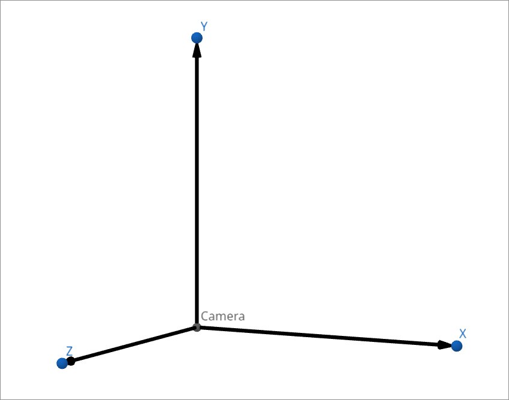

# Ray Tracer
Porting of a ray tracer in Rust.

In order to use the program, either clone the repo and use 
```bash
cargo run --release
```  
or download the latest release and create a **data** folder in the same directory where you will execute the program.  

## World initialization
Use the provided world.json as a template.
To add a new sphere, add a new element to the vector in the json:
```
{
        "center":{
            "e":[1.1,0.0,-4.0]
            },
        "radius":3.5,
        "material":{
            "Metal":{
                "albedo":[1.0,0.5,1.0],
                "fuzz": 0.5
            }
        }
    }
```  

>The example above represents a Sphere with **center** at __[1.1, 0.0, -4.0]__, with a **radius** of __3.5__ and a **Metal material** with a certain **albedo** and **fuzziness**  

The **lights** array needs to contain spheres only with the _Light_ material.

This is the orientation of the axis:
  


To sum up, this needs to be your directories configuration:
```rust
    _some_dir
    ├── ray_tracer  // This is the executable file
    ├── state.json  // File that sets all the environment variables 
    └── _data 
        └──         // images will be generated here 
```

## Static image rendering


## Video Render (multiple static images + ffmpeg)


